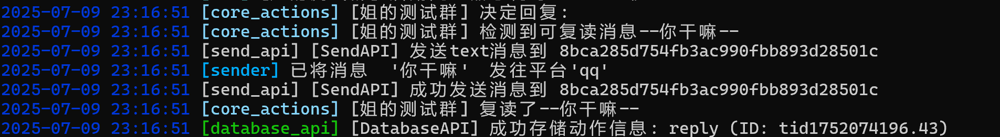

# 麦麦复读插件 (MaiBot_repeat_plugin)
作者：火火火木（SkillfulPainter）

## 简介
修改了位于 **"MaiBot\src\plugins\built_in\core_actions\plugin.py"** 中内置的reply_plugin，在使用LLM生成回复之前新增了判断麦麦是否需要复读的方法。该更改在enable_repeat参数设置为false时不会对正常回复有任何影响。在判断复读不通过时会进入正常回复流程。
本人代码能力有限，希望能多向我提提意见，不胜感谢！

**判断复读的条件如下：**
1. enable_repeat参数是否为true，若是，则进行下一步
2. 麦麦是否在之前5分钟内/之前的6条消息内发过言，若是则不进行复读。若否，则进行下一步。
3. 之前5分钟内/之前的6条消息内是否有完全一致的消息，如果有，将复读这条消息，如果没有，不进行复读。检查消息的顺序为时间上由近到远。如果在六条消息内有多次不同复读，则麦麦会复读距离当前时间近的一条。

## 使用方法
# ⚠️ ！！必读！！ ⚠️
将这个plugin中的plugin.py文件复制到 **"MaiBot\src\plugins\built_in\core_actions"** 目录下并覆盖其中的 **plugin.py** 文件。然后删除该目录里的config.toml让麦麦在运行时生成新的配置文件。
# ⚠️ 覆盖前一定要备份原文件！ ⚠️
# ⚠️ 覆盖前一定要备份原文件！ ⚠️
# ⚠️ 覆盖前一定要备份原文件！ ⚠️
你没备份导致原来的东西没了别来找我。
希望用这个插件的人都知道自己在干什么。

## 使用效果

